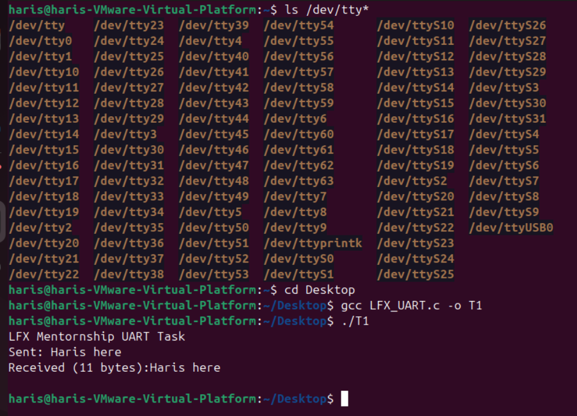

# LFX_UART-Mentorship-task
This repository consists of the solution of coding challenge by LFX_Mentorship. Pictures, build and run instruction are also attached.

In this repository, you will find the code for the problem provided by LFX. 

I have used dev/tty/US0, termios api. 
All the code is written in the C language, and Ubuntu(LINUX) is used. 
The code basically transmits any message. The receiver receives the message, and the received message is printed. 
I have used the CP2102 USB-to-UART converter for this task. The TX and RX pins are being connected; this means whatever is being sent will be received exactly and printed. As the problem didn't specifically mention, transmitting message and receiving message should be different. 

**Commands used to build/run**

1- `ls/dev/tty*`   to specify the device's tty 
2- `cd Desktop`    to go to Desktop 
3- `touch LFX_UART.c`     to create this file in desktop 
4- `gcc LFX_UART.c -o T1`    to build the program 
5- `./T1`      to run 

 

**Hardware connection**

**Output**

